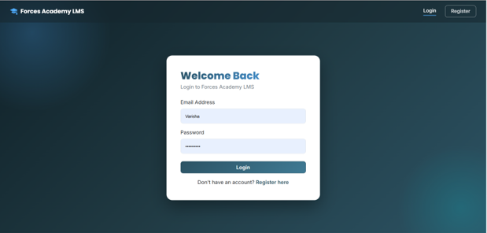
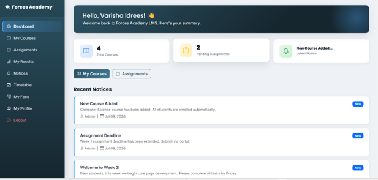
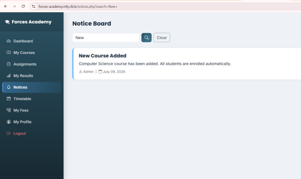
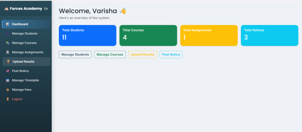
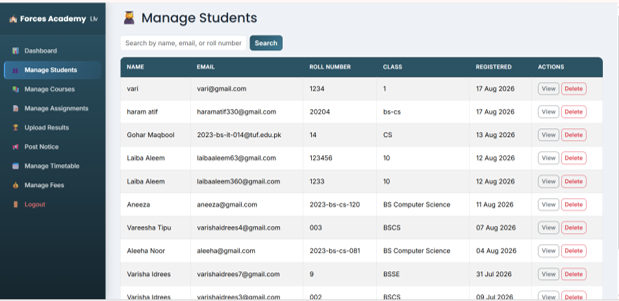

# Forces Academy LMS

A full-stack Learning Management System built for Forces Academy Faisalabad — students can log in, view courses, check their timetable, submit assignments, track fees and results, while admins manage the entire academy from a dedicated admin panel.

**🔗 Live Site:** [forces-academy.infy.click](https://forces-academy.infy.click/)
**📦 Repository:** [github.com/varishaidrees3-source/forces-academy-lms](https://github.com/varishaidrees3-source/forces-academy-lms)

---

## 📸 Screenshots

| Login | Student Dashboard |
|---|---|
|  |  |

| Notices & Fees | Admin Dashboard |
|---|---|
|  |  |

| Manage Students (Admin) |
|---|
|  |

---

## 🛠️ Tech Stack

- **Backend:** PHP (procedural, `mysqli` with prepared statements)
- **Database:** MySQL
- **Frontend:** HTML, CSS, JavaScript, [Bootstrap 5.3.3](https://getbootstrap.com/), Bootstrap Icons
- **Hosting:** InfinityFree (live PHP + MySQL hosting)
- **Auth:** Session-based authentication with separate student and admin sessions

---

## ✨ Features

### Student Portal
- Register and log in securely (hashed passwords)
- Personal dashboard with enrolled course count and latest notices
- Browse courses and view class timetable
- Submit assignments online
- View results and track fee status
- Edit personal profile

### Admin Panel
- Secure admin login, fully separated from student sessions
- Dashboard with live stats (Students, Courses, Assignments, Notices)
- Manage students — search, view details, delete
- Manage courses — add, edit, delete
- Manage assignments — add, delete
- Upload and manage student results
- Post and delete notices
- Manage timetable entries
- Track and update fee status
- Route protection — direct access to any admin page without a session redirects to login

---

## 💻 How to Run Locally

1. **Install XAMPP** (or any local server with PHP 8.1+ and MySQL) — [download here](https://www.apachefriends.org/)
2. **Clone the repo** into your `htdocs` folder:
   ```bash
   cd C:\xampp\htdocs
   git clone https://github.com/varishaidrees3-source/forces-academy-lms.git
   ```
3. **Create the database** — open phpMyAdmin, create a database (e.g. `forces_lms`), and import the schema (see `/database` if included, or set up the tables: `students`, `admins`, `courses`, `notices`, `assignments`, `results`, `fees`, `timetable`).
4. **Configure the database connection** — create `config/db.php` (this file is git-ignored for security) with:
   ```php
   <?php
   mysqli_report(MYSQLI_REPORT_OFF);
   $host = 'localhost';
   $user = 'root';
   $password = '';
   $database = 'forces_lms';
   $conn = mysqli_connect($host, $user, $password, $database);
   if (!$conn) { die('Database connection failed: ' . mysqli_connect_error()); }
   mysqli_set_charset($conn, 'utf8mb4');
   ?>
   ```
5. **Create your first admin account** by visiting `admin/create_admin.php` once, then **delete that file** immediately after (it's not safe to leave live).
6. **Start Apache and MySQL** in XAMPP, then visit:
   ```
   http://localhost/forces-academy-lms/
   ```

---

## 🔒 Security Notes

- Passwords are hashed with `password_hash()` / verified with `password_verify()`
- All database queries use prepared statements to prevent SQL injection
- `config/db.php` and `admin/create_admin.php` are excluded from version control via `.gitignore`
- Student and admin sessions are fully isolated (`$_SESSION['student_id']` vs `$_SESSION['admin_id']`)

---

## Built by

**Varisha Idrees** | Code Saviours SI-26 | 2026
